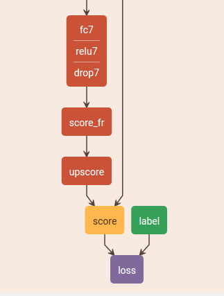
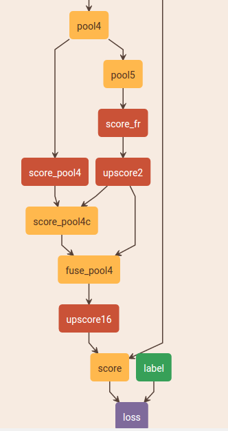
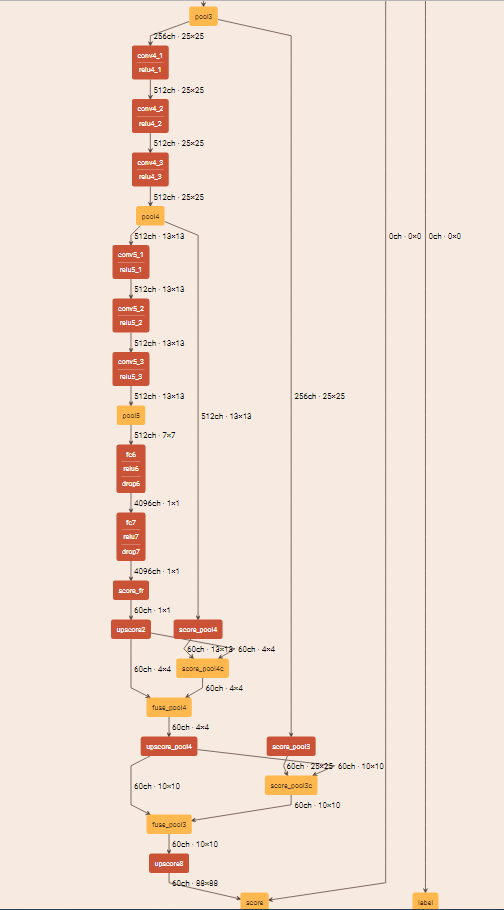

### 32X
+ 从conv1_1到pool5照搬了vgg net的网络结构
+ fc6与fc7将vgg的全连接层改成了1×11×1的卷积层. (各自还加了一个Dropout层). fc7的输出score_fr作为分类score.
+ 32倍的FCN直接将score_fr通过 Convolution Transpose, 或人们习惯的Deconvolution将其放大32倍, 然后crop到原图大小. 

### 16X
+ 将score_fr放大两倍得到upscore2
+ 在pool4上加一个1×11×1的conv层, 得到score_pool4
+ 将score_pool4 crop到与upscore2一样的形状, 得到score_pool4c. crop的对象是score_pool4, 因为它可能比upscore2要大.
+ fuse_pool4 = score_pool4c + upscore2
+ 将fuse_pool4放大16倍,然后crop, 得到与原图大小相同的score.

### 8x
+ 在pool3上面也加一个1×11×1的conv层, 得到score_pool3
+ 将fuse_pool4放大两倍得到upscore_pool4
+ 将score_pool3crop到与upscore_pool4相同的size, 得到score_pool3c
+ fuse_pool3 = score_pool3c + upscore_pool4
+ 将fuse_pool3放大8倍, 然后crop到原图大小.

